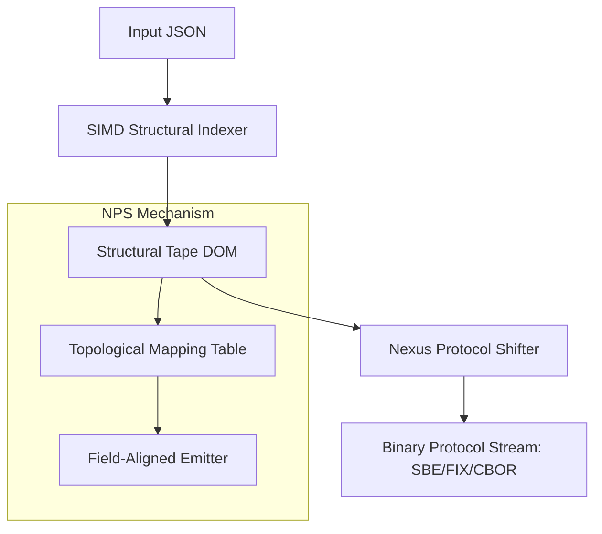
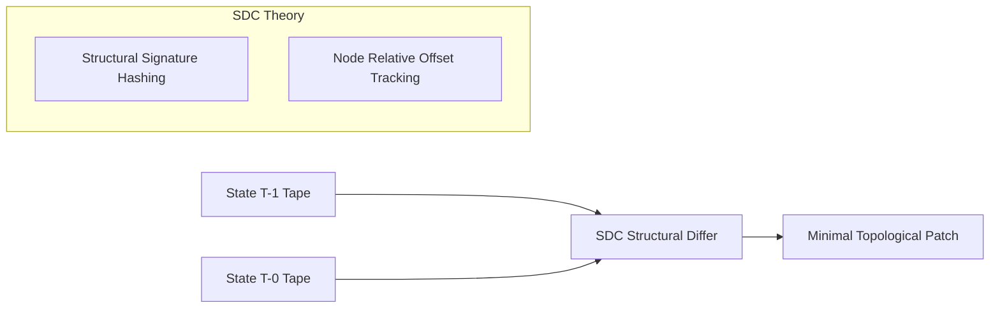
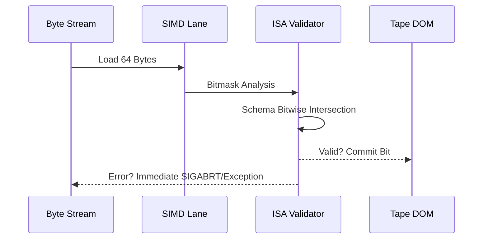

# Technical Design: The Nexus Theory (Milestone 1.1)

This document formalizes "The Nexus Theory," the architectural foundation for `qbuem-json` Milestone 1.1. It is designed to provide 100% technical clarity for both developers and future AI agents.

## 1. Executive Summary

The Nexus Theory treats JSON not as a hierarchical object tree, but as a **topological stream of structural atoms**. By leveraging the Phase 1 Tape DOM, we can establish zero-copy bridges between JSON and industrial binary formats, and optimize data transmission through structural entropy analysis.

---

## 2. Core Architectural Pillars

### 2.1 Nexus Protocol Shifting (NPS)
**Objective**: Unified zero-copy transcoding between JSON and binary protocols (SBE, FIX).

**Rationale**: Traditional converters deserialize to intermediate objects. NPS uses the Tape DOM as a "read-only cursor" to emit protocol-aligned fields directly into memory, maintaining L1/L2 cache locality.

### 2.2 Structural Delta Compression (SDC)
**Objective**: Maximum bandwidth efficiency for real-time state synchronization.

**Rationale**: SDC operates on the *structure* rather than the data values. It identifies recurring sub-tree patterns and encodes changes as "Topological Shifts," allowing for sub-byte diffing of large objects.

### 2.3 Inline Schema Assurance (ISA)
**Objective**: SIMD-fused validation during the first pass.

**Rationale**: Standard parsers separate parsing and validation. ISA fuses them. The validation happens *inside* the SIMD loop, utilizing unused CPU cycles during structural indexing.

---

## 3. Industrial Interoperability Suite

### 3.1 Nexus IDL Inference (NII)
A metadata reflection utility that extracts structural requirements from `Nexus Fusion` C++ mapping definitions to generate `.proto` (Protobuf) or `.fbs` (FlatBuffers) files.

### 3.2 Nexus Codegen (NCG)
A specialized C++ generator that produces inlined, "swizzled" conversion functions. These functions are optimized by the compiler to perform field-to-field copying from the Tape DOM to a PBuf buffer without branch-heavy generic reflection.

---

## 4. Implementation Strategy (Milestone 1.1)

| Module | Phase | Dependency | Goal |
| :--- | :--- | :--- | :--- |
| **NPS Core** | 1.1.a | None | C++ Zero-Copy API for SBE |
| **ISA Engine** | 1.1.b | SIMD Backend | Schema validation via Tape bits |
| **NII Utility** | 1.1.c | CMake/Clang libtool | Automated IDL extraction |
| **SDC Proto** | 1.1.d | None | Topological Diffing Algorithm |

---

## 5. Metadata for Future Agents
- **Core Namespace**: `qbuem::nexus`
- **Primary Data Structure**: `qbuem::TapeDOM` (Immutable)
- **Design Philosophy**: Latency is a function of memory movement. **Zero-copy is the only path.**
