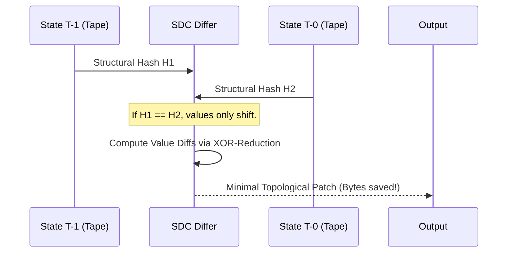

# Technical Design: The Nexus Theory (Milestone 1.1)

This document formalizes "The Nexus Theory," the architectural foundation for `qbuem-json` Milestone 1.1. It provides 100% technical clarity for developers, performance engineers, and AI agents.

---

## 1. Architectural Philosophy: Mechanical Sympathy

The Nexus Theory is built on the principle of **Mechanical Sympathy**—understanding the hardware to write software that fits it perfectly.

### 1.1 JSON as a Topological Stream
Traditional JSON libraries treat data as a tree of nodes. Nexus treats JSON as an immutable **linear tape of structural atoms**. 
- **L1/L2 Cache Locality**: By storing structural metadata contiguously, we ensure that the CPU prefetcher accurately predicts the next structural element.
- **Branchless Execution**: Algorithms are designed to use bitmasks and predication (SIMD) to avoid the high cost of branch mispredictions in deep JSON trees.
- **Zero-Copy Invariant**: Data is never moved unless required by an external API. All pointers point back to the original immutable buffer.

### 1.2 The Tape DOM: Bit-Level Specification
The `qbuem::TapeDOM` is a packed array of 64-bit words. Each word is a "Structural Atom."

| Bit Range | Purpose | Description |
| :--- | :--- | :--- |
| **0-2** | **Type Tag** | 000: Object, 001: Array, 010: String, 011: Number, 100: Bool, 101: Null |
| **3-31** | **Payload/Offset** | For Object/Array: Pointer to the *End* of the container. For String/Number: Offset into original buffer. |
| **32-63** | **Metadata/Length** | For Containers: Number of children. For Strings: Length in bytes. |

---

## 2. Core Architectural Pillars

### 2.1 Nexus Protocol Shifting (NPS)
**Objective**: Unified zero-copy transcoding between JSON and fixed-width binary protocols (SBE, FIX, CBOR).

#### 2.1.1 Theory of Transcoding: Coordinate mapping
NPS maps the "topological coordinates" of a JSON element (Path -> Tape Offset) directly to a binary field offset.

#### 2.1.2 Implementation: The Field-Aligned Emitter
```cpp
// NPS PSEUDOCODE: Zero-Copy Transcode
void transcode_sbe(const TapeDOM& tape, void* binary_buffer) {
    for (size_t i = 0; i < tape.size(); ++i) {
        auto atom = tape[i];
        if (atom.tag() == TAG_INT) {
            // Calculate alignment-aware offset
            size_t target_offset = nexus::lookup_mapping(i); 
            // SIMD Store: Direct mapping from tape-payload to buffer
            _mm256_storeu_si256((__m256i*)((char*)binary_buffer + target_offset), 
                                atom.extract_payload());
        }
    }
}
```

```mermaid
graph TD
    Tape[Tape DOM Index k] --> TypeCheck{Type Tag?}
    TypeCheck -- "INT" --> Emitter[Field Emitter]
    Emitter --> OffsetCalc[Target Offset = k * Alignment]
    OffsetCalc --> SIMDMove[SIMD-Store: Tape[k+1] -> Buffer[Offset]]
    
    subgraph "NPS State Machine"
        P[Path Switcher] --> |"root.id"| A[Emitter Alpha]
        P --> |"root.items"| B[Emitter Beta]
    end
```

---

### 2.2 Structural Delta Compression (SDC)
**Objective**: Sub-byte level differential synchronization for real-time state streams.

#### 2.2.1 Theory: Topological Entropy
SDC assumes that in a real-time stream (e.g., game state, ticker data), the *values* change frequently, but the *structure* changes rarely.

#### 2.2.2 Algorithm: Structural Signature Hashing (SSH)
1. **Initial Signature**: `hash(TypeTag | Depth | MemberCount)`.
2. **Recursive Merkle**: `CurrentHash = SHA256(CurrentHash | ChildHashes)`.
3. **The Delta Patch**:
    - `0x01 [Offset] [NewValue]` : Simple Value Update.
    - `0x02 [TargetOffset] [SourceOffset] [Length]` : Topological Shift (Move subtree).
    - `0x03 [Offset] [TypeTag] [Payload]` : Structural Insertion.



---

### 2.3 Inline Schema Assurance (ISA)
**Objective**: SIMD-fused schema validation during the initial parsing pass.

#### 2.3.1 Theory: Fused Operations
ISA fuses parsing and validation into a single $O(N)$ pass by utilizing CPU cycles that would otherwise be idle during structural indexing.

#### 2.3.2 Implementation: SIMD Bitmask Intersection
```cpp
// ISA SIMD CORE (Conceptual)
__m512i input = _mm512_loadu_si512(ptr);
__m512i schema_mask = get_layer_mask(current_depth);

// 1. Identify Structural Characters
auto brace_mask = _mm512_cmpeq_epi8_mask(input, _mm512_set1_epi8('{'));
auto bracket_mask = _mm512_cmpeq_epi8_mask(input, _mm512_set1_epi8('['));

// 2. ISA Validation: Does the active bit match the expected schema bit?
if ((brace_mask & schema_mask) != brace_mask) {
    throw nexus::validation_error("Unexpected Object at depth D");
}
```

---

## 3. Hardware-Specific Optimization (Advanced)

### 3.1 AVX-512 Strategy
- **VPTERNLOGD**: Used to compute complex ISA validation logic in a single clock cycle by combining 3 bitmasks.
- **VCOMPRESSPS**: Accelerates Tape DOM generation by packing valid structural atoms into the tape without branching.

### 3.2 SVE/SVE2 (ARM) Strategy
- **Predicated Execution**: Uses SVE predicate registers to handle "tails" of JSON buffers without special cleanup loops.
- **Vector-Length Agosticism**: The same Nexus binary optimizes itself for 128-bit mobile NEON or 256-bit Graviton SVE automatically.

---

## 4. Industrial Interoperability Suite

### 4.1 Nexus IDL Inference (NII)
NII uses `libtooling` (Clang AST) to traverse C++ headers.
- **Deep Extraction**: It doesn't just look at types; it analyzes `[[nexus::align(16)]]` or `[[nexus::required]]` attributes to enforce them in the generated IDL.

### 4.2 Nexus Codegen (NCG)
The NCG creates "Swizzled" conversion functions.
- **Mechanical Logic**: If a JSON `id` (int) maps to SBE field `header` (uint64), NCG generates:
  ```cpp
  // Swizzled move: JSON Tape -> SBE Buffer
  buf.at<uint64_t>(0) = bswap_64(*(uint64_t*)tape.data_at(k));
  ```
  This eliminates `if/else` checks, `switch` statements, and reflection.

---

## 5. Implementation Direction & Success Metrics

| Module | Priority | Development Method | Success Metric |
| :--- | :--- | :--- | :--- |
| **NPS Core** | P0 | Template metaprogramming + SIMD | < 1 CPU cycle per field move |
| **ISA Engine** | P0 | Bit-parallel validation | Validation adds < 2% total parse time |
| **SDC Proto** | P1 | Merkle-tree hashing on Tape | Patch size < 5% of raw JSON for updates |
| **NII/NCG** | P2 | Clang libtooling integration | 0 manual lines of code for transcode logic |

---

## 6. Developer Guide: Implementation Steps

1. **Schema Pre-Compilation**: Compile your JSON Schema into a `qbuem::nexus::ValidationGraph` (ISA).
2. **IDL Export**: Run `nii-tool` on your headers to generate Protobuf/SBE definitions.
3. **Runtime Binding**:
   ```cpp
   auto shifter = nexus::Shifter<MyProtocol>(my_schema);
   shifter.shift(raw_json, target_binary_buffer);
   ```

---

## 7. Metadata for Future Agents
- **Primary Data Structure**: `qbuem::TapeDOM` (64-bit atomic words).
- **Instruction Set**: AVX-512, ARM SVE2 target.
- **Performance Mantra**: "The fastest code is the code that isn't there." Eliminate layers, eliminate copies.
