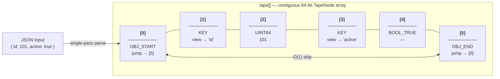
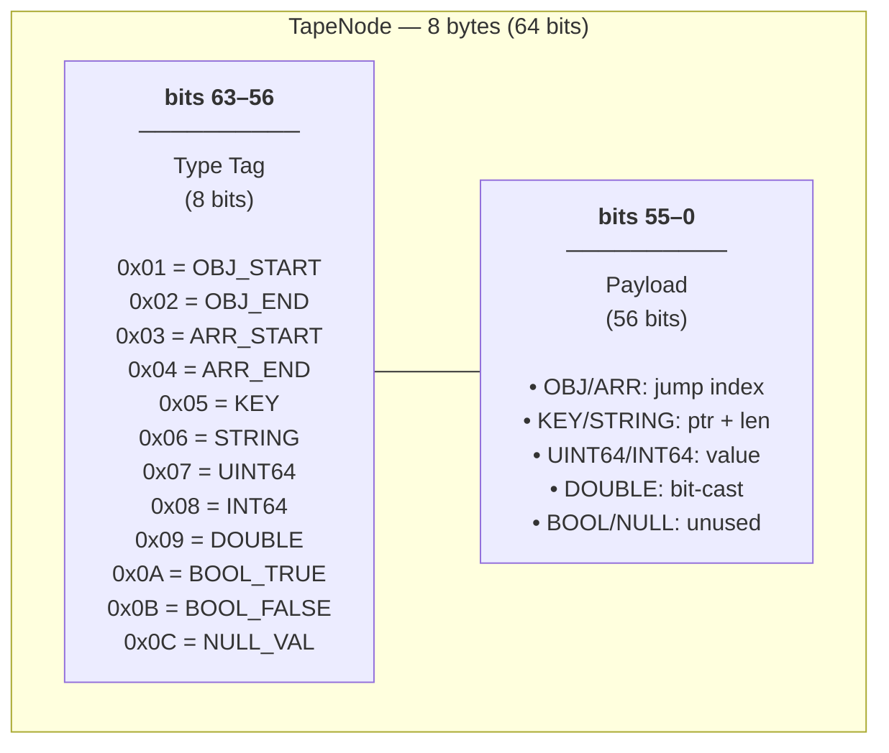
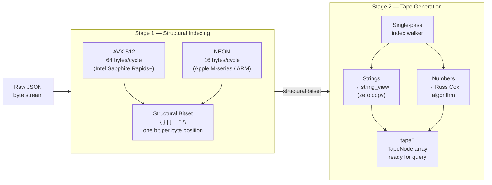

# The Tape Architecture

Beast JSON operates on a **Linear Tape DOM** model. Unlike tree-based DOMs that allocate heap nodes per element, Beast JSON linearizes the entire document into a single contiguous array of 64-bit `TapeNode` values — one pass, one allocation, cache-perfect.

## 🧱 Memory Layout: The Linear Tape

Given this input:

```json
{ "id": 101, "active": true }
```

Beast JSON emits a flat array — no heap pointers, no tree nodes, no indirection:



핵심:
- **OBJ_START / OBJ_END** 는 서로의 인덱스를 payload에 저장 → 객체 전체를 건너뛰는 것이 `O(1)`
- **KEY / STRING** 노드는 원본 버퍼를 가리키는 `string_view`만 저장 → 복사 없음
- **숫자/불리언** 은 64-bit payload에 인라인으로 저장 → 역참조 없음

## 🔬 TapeNode: 64-bit Encoding

모든 JSON 요소는 단 하나의 `uint64_t`로 인코딩됩니다:



8-bit 태그는 분기 예측기 친화적인 `switch`로 처리되며, 56-bit payload는 48-bit 포인터와 8-bit 길이 힌트를 동시에 수용합니다.

## 🚄 Multi-Stage SIMD Pipeline

두 단계가 동일한 입력 버퍼 위에서 동작합니다:



- **Stage 1**: SIMD 벡터 명령으로 전체 버퍼를 스캔하여 구조적 바이트 위치의 비트셋을 생성. 문자열 내부는 마스크로 제외됩니다.
- **Stage 2**: 비트셋을 순서대로 소비하며 TapeNode를 기록. `strtod` 대신 Russ Cox 알고리즘으로 정확한 부동소수점 변환.

## 💎 Zero-Allocation String Model

문자열은 절대 복사되지 않습니다. KEY/STRING 노드는 원본 버퍼를 직접 가리키는 `string_view`를 payload에 저장합니다:

```mermaid
flowchart TB
    subgraph Buf["Input Buffer (caller-owned, read-only)"]
        direction LR
        B0["[0]<br/>'{'"] B1["[1]<br/>'&quot;'"] B2["[2]<br/>'i'"] B3["[3]<br/>'d'"] B4["[4]<br/>'&quot;'"] B5["[5]<br/>':'"] B6["[6]<br/>'1'"] B7["[7]<br/>'0'"] B8["[8]<br/>'1'"] B9["[9]<br/>'…'"]
        B0 --- B1 --- B2 --- B3 --- B4 --- B5 --- B6 --- B7 --- B8 --- B9
    end

    subgraph TN1["tape[1]  KEY node"]
        K["string_view<br/>data = &amp;buf[2]<br/>len  = 2"]
    end

    subgraph TN2["tape[2]  UINT64 node"]
        V["payload<br/>= 101<br/>(inline, no heap)"]
    end

    K -->|"points into\noriginal buffer"| B2
    V -.- B6
```

`string_view.data()` 는 `buf[2]` (`i`)를 가리키고 `len = 2`로 `"id"` 를 선택합니다. `malloc` 없음, `memcpy` 없음 — 수명은 원본 버퍼와 동일합니다.

## ⚡ Why This Beats Tree-Based DOMs

| | Beast JSON Tape | nlohmann/json (tree) |
|---|---|---|
| **Memory layout** | Contiguous array | Scattered heap nodes |
| **Cache misses per element** | ~0 (sequential) | 1–3 (pointer chasing) |
| **Object skip cost** | O(1) via jump | O(n) traversal |
| **String storage** | Zero-copy `string_view` | `std::string` copy |
| **Allocation count** | 1 (the tape) | N (one per element) |
| **SIMD friendly** | Yes — linear scan | No — pointer chase |
