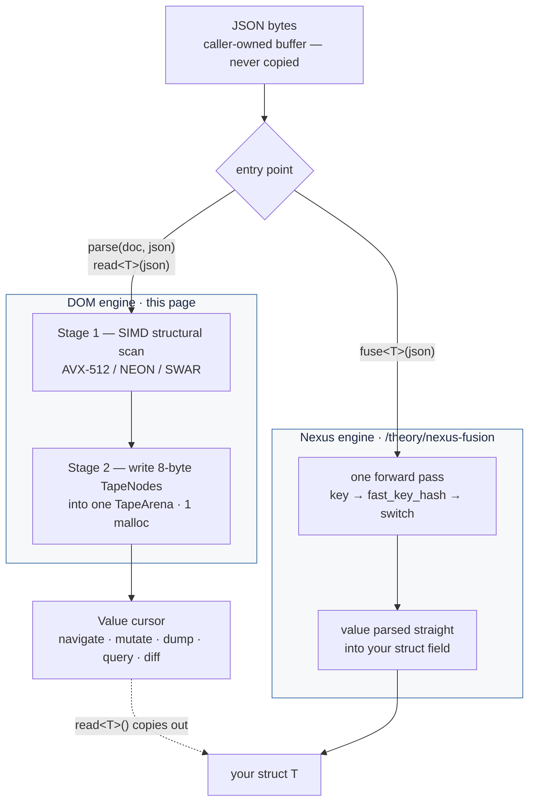

# The Tape: a Flat-Array DOM

qbuem-json ships **two parser engines** in one header. This page is about the **DOM
engine** — the one that builds a navigable, mutable document. (The zero-tape engine
that maps JSON straight onto a C++ struct is [Nexus Fusion](/theory/nexus-fusion).)
Here is the whole picture before we zoom in — which entry point drives which engine,
and what each produces:


```mermaid
flowchart TB
    J["JSON bytes<br/>caller-owned buffer — never copied"]
    J --> Q{"entry point"}
    Q -->|"parse(doc, json)<br/>read&lt;T&gt;(json)"| DOMa
    Q -->|"fuse&lt;T&gt;(json)"| NEXa

    subgraph DOM["DOM engine · this page"]
      direction TB
      DOMa["Stage 1 — SIMD structural scan<br/>AVX-512 / NEON / SWAR"] --> DOMb["Stage 2 — write 8-byte TapeNodes<br/>into one TapeArena · 1 malloc"]
    end
    subgraph NEX["Nexus engine · /theory/nexus-fusion"]
      direction TB
      NEXa["one forward pass<br/>key → fast_key_hash → switch"] --> NEXb["value parsed straight<br/>into your struct field"]
    end

    DOMb --> VAL["Value cursor<br/>navigate · mutate · dump · query · diff"]
    VAL -.->|"read&lt;T&gt;() copies out"| STR["your struct T"]
    NEXb --> STR

    classDef eng fill:#1a274408,stroke:#3b6ea5,color:#1a2744;
    class DOM,NEX eng;
```

The DOM engine is the right tool when the schema is unknown at compile time, when you
only read part of a large document, or when you need to mutate and re-serialize.
Everything below is how its tape makes that fast.

---

A 50 KB JSON document with 1,000 string values makes `nlohmann/json` call `malloc` over 1,000 times. Each node ends up at a random heap address. When you traverse the result, every key and every value is a pointer chase to a different cache line. The CPU's prefetcher stops trying.

qbuem-json parses the same document with **one allocation**. Here's why that's possible and how it works.

---

## The problem isn't parsing — it's what parsers build

Tree-based parsers build a tree. That sounds obvious, but it has a specific performance implication: a tree requires one heap node per element, and those nodes land wherever `malloc` puts them. For this JSON:

```json
{ "id": 101, "name": "Alice", "active": true }
```

`nlohmann/json` allocates something like this:

<div class="bd-diagram">
  <div class="bd-col">
    <div class="bd-group" style="width:100%;max-width:540px;">
      <div class="bd-group__title">nlohmann/json — 3 fields, 6+ heap allocations, scattered addresses</div>
      <div class="bd-group__body" style="font-family:var(--vp-font-family-mono);font-size:0.78rem;line-height:1.9;">
        <div style="display:grid;grid-template-columns:1fr 1fr;gap:0.3rem 1.5rem;padding:0.25rem 0;">
          <div class="bd-box bd-box--orange" style="padding:0.3rem 0.5rem;font-size:0.75rem;">0x5a40 Object node<br><small style="color:var(--vp-c-text-3);">→ ptr → children vector</small></div>
          <div class="bd-box bd-box--orange" style="padding:0.3rem 0.5rem;font-size:0.75rem;">0x7f23 children vec<br><small style="color:var(--vp-c-text-3);">heap-allocated</small></div>
          <div class="bd-box" style="padding:0.3rem 0.5rem;font-size:0.75rem;">0x3c11 key "id"<br><small style="color:var(--vp-c-text-3);">heap-copied string</small></div>
          <div class="bd-box" style="padding:0.3rem 0.5rem;font-size:0.75rem;">0x12ef IntNode(101)<br><small style="color:var(--vp-c-text-3);">separate heap object</small></div>
          <div class="bd-box" style="padding:0.3rem 0.5rem;font-size:0.75rem;">0x9d04 key "name"<br><small style="color:var(--vp-c-text-3);">heap-copied string</small></div>
          <div class="bd-box" style="padding:0.3rem 0.5rem;font-size:0.75rem;">0x4a17 StringNode "Alice"<br><small style="color:var(--vp-c-text-3);">heap-copied string</small></div>
        </div>
        <div style="margin-top:0.5rem;font-size:0.75rem;color:var(--vp-c-text-2);">
          3 fields → 6 cache lines touched on every traversal
        </div>
      </div>
    </div>
  </div>
</div>

Two things make this slow, and they're related. First, every access chases a pointer to an unpredictable address — the CPU can't prefetch what it can't predict. Second, every string gets copied at parse time, whether you ever read it or not. A 100-field JSON payload where you only need 3 fields still pays for all 100 copies.

There's also a third problem: when you want to skip a nested structure — say, a 500-element array under a key you don't care about — a tree-based DOM has no choice but to walk all 500 elements.

---

## A flat array fixes all three

qbuem-json doesn't build a tree. It writes a **flat contiguous array** — the tape — with one 8-byte slot per JSON element. Same input, entirely different layout:

<div class="bd-diagram">
  <div class="bd-col">
    <div class="bd-box bd-box--brand" style="max-width:360px;font-family:monospace;">{ "id": 101, "name": "Alice", "active": true }</div>
    <div class="bd-arrow"><div class="bd-arrow__icon">↓</div><div class="bd-arrow__label">single-pass parse — one malloc</div></div>
    <div class="bd-tape-strip">
      <div class="bd-tape-cell bd-tape-cell--obj"><span class="bd-tape-cell__idx">tape[0]</span><span class="bd-tape-cell__tag">ObjectStart</span><span class="bd-tape-cell__val">off→0</span></div>
      <div class="bd-tape-cell bd-tape-cell--key"><span class="bd-tape-cell__idx">tape[1]</span><span class="bd-tape-cell__tag">StringRaw</span><span class="bd-tape-cell__val">off=3 len=2 "id"</span></div>
      <div class="bd-tape-cell bd-tape-cell--int"><span class="bd-tape-cell__idx">tape[2]</span><span class="bd-tape-cell__tag">Integer</span><span class="bd-tape-cell__val">off=8 len=3 "101"</span></div>
      <div class="bd-tape-cell bd-tape-cell--key"><span class="bd-tape-cell__idx">tape[3]</span><span class="bd-tape-cell__tag">StringRaw</span><span class="bd-tape-cell__val">off=14 len=4 "name"</span></div>
      <div class="bd-tape-cell bd-tape-cell--str"><span class="bd-tape-cell__idx">tape[4]</span><span class="bd-tape-cell__tag">StringRaw</span><span class="bd-tape-cell__val">off=22 len=5 "Alice"</span></div>
      <div class="bd-tape-cell bd-tape-cell--key"><span class="bd-tape-cell__idx">tape[5]</span><span class="bd-tape-cell__tag">StringRaw</span><span class="bd-tape-cell__val">off=31 len=6 "active"</span></div>
      <div class="bd-tape-cell bd-tape-cell--bool"><span class="bd-tape-cell__idx">tape[6]</span><span class="bd-tape-cell__tag">BooleanTrue</span><span class="bd-tape-cell__val">—</span></div>
      <div class="bd-tape-cell bd-tape-cell--obj"><span class="bd-tape-cell__idx">tape[7]</span><span class="bd-tape-cell__tag">ObjectEnd</span><span class="bd-tape-cell__val">—</span></div>
    </div>
    <div class="bd-callout" style="font-size:0.8rem;margin-top:0.5rem;">
      8 nodes × 8 bytes = 64 bytes. <strong>Exactly one CPU cache line.</strong>
    </div>
  </div>
</div>

Notice what's different. The nodes are sequential — the CPU prefetcher pulls them in cache-line-at-a-time. Strings and numbers are never copied: a `StringRaw`, `Integer`, or `Double` node stores only a `(offset, length)` slice into the original input buffer (and the number's digits aren't even converted until you ask for them — see below). An object is just an `ObjectStart … ObjectEnd` pair with its keys and values laid out in between; there is no separate key store and no child-pointer array.

The flat array is the whole design. Every other mechanism is a consequence of it.

---

## But first, qbuem-json doesn't read most of your input

Before writing a single tape node, qbuem-json runs a SIMD scan that classifies **64 bytes at once** using a single AVX-512 instruction. The output is a 64-bit bitmask — one bit per byte — where a `1` marks a structural character (`{`, `}`, `[`, `]`, `"`, `:`, `,`) and `0` marks data.

<div class="bd-diagram">
  <div class="bd-col">
    <div class="bd-group" style="width:100%;max-width:580px;">
      <div class="bd-group__title">Stage 1 — one AVX-512 pass, 64 bytes in, 64-bit mask out</div>
      <div class="bd-group__body">
        <div class="bd-pipeline">
          <div class="bd-pipe-stage">
            <div class="bd-pipe-stage__label">Load</div>
            <div class="bd-pipe-stage__main">_mm512_loadu_si512</div>
            <div class="bd-pipe-stage__note">64 bytes → ZMM</div>
          </div>
          <div class="bd-pipe-arrow">→</div>
          <div class="bd-pipe-stage">
            <div class="bd-pipe-stage__label">Classify</div>
            <div class="bd-pipe-stage__main">cmpeq / cmpgt → __mmask64</div>
            <div class="bd-pipe-stage__note">brackets · quotes · backslash · whitespace</div>
          </div>
          <div class="bd-pipe-arrow">→</div>
          <div class="bd-pipe-stage">
            <div class="bd-pipe-stage__label">Suppress + Emit</div>
            <div class="bd-pipe-stage__main">prefix_xor → ctzll</div>
            <div class="bd-pipe-stage__note">mask out in-string chars, write structural offsets</div>
          </div>
        </div>
      </div>
    </div>
  </div>
</div>

The tape-writing pass (Stage 2) then iterates only the `1` bits using `TZCNT` — one instruction that finds the next set bit in a single cycle. Typical JSON has 5–15% structural characters. Stage 2 touches 5–15% of the input. The rest of your bytes are never visited.

On ARM (Apple Silicon, Linux aarch64), four NEON 16-byte loads replace one AVX-512 load. The bitmask algorithm is identical.

> Full SIMD mechanics, including the prefix-XOR string-suppression step: [SIMD Acceleration →](/theory/simd)

---

## Eight bytes, two words

Every node is the same `TapeNode`: two 32-bit words, `meta` and `offset`. No node ever exceeds 8 bytes, and `static_assert(sizeof(TapeNode) == 8)` keeps it that way.

<div class="bd-diagram">
  <div class="bd-col">
    <div class="bd-bits">
      <div class="bd-bit-seg" style="width:84px;flex-shrink:0;background:color-mix(in srgb,var(--vp-c-brand-1) 22%,transparent);border-radius:4px 0 0 4px;">
        <span class="bd-bit-seg__range">meta 31–24</span>
        <span class="bd-bit-seg__val">Type</span>
        <span class="bd-bit-seg__name">8 bits — 11 types</span>
      </div>
      <div class="bd-bit-seg" style="width:84px;flex-shrink:0;background:color-mix(in srgb,var(--vp-c-brand-1) 14%,transparent);">
        <span class="bd-bit-seg__range">meta 23–16</span>
        <span class="bd-bit-seg__val">Flags</span>
        <span class="bd-bit-seg__name">8 bits — separator</span>
      </div>
      <div class="bd-bit-seg" style="flex:1;background:color-mix(in srgb,var(--vp-c-brand-1) 9%,transparent);border:1px solid var(--vp-c-divider);border-radius:0 4px 4px 0;">
        <span class="bd-bit-seg__range">meta 15–0</span>
        <span class="bd-bit-seg__val">Length</span>
        <span class="bd-bit-seg__name">16 bits — token length ≤ 65535</span>
      </div>
    </div>
    <div class="bd-bits" style="margin-top:0.35rem;">
      <div class="bd-bit-seg" style="flex:1;background:color-mix(in srgb,#43a047 12%,transparent);border:1px solid var(--vp-c-divider);border-radius:4px;">
        <span class="bd-bit-seg__range">offset 31–0</span>
        <span class="bd-bit-seg__val">Source offset</span>
        <span class="bd-bit-seg__name">32 bits — byte offset into the input (≤ 4 GB)</span>
      </div>
    </div>
    <div class="bd-row" style="gap:0.75rem;margin-top:0.75rem;flex-wrap:wrap;">
      <div class="bd-group" style="flex:1;min-width:150px;margin:0;">
        <div class="bd-group__title" style="font-size:0.68rem;">Containers</div>
        <div class="bd-group__body" style="padding:0.35rem;">
          <div class="bd-box bd-box--teal" style="font-size:0.72rem;padding:0.3rem 0.5rem;"><code>ObjectStart/End<br>ArrayStart/End</code><br><small>plain markers —<br>no end-index, no child list</small></div>
        </div>
      </div>
      <div class="bd-group" style="flex:1;min-width:150px;margin:0;">
        <div class="bd-group__title" style="font-size:0.68rem;">Strings &amp; numbers</div>
        <div class="bd-group__body" style="padding:0.35rem;">
          <div class="bd-box bd-box--purple" style="font-size:0.72rem;padding:0.3rem 0.5rem;"><code>StringRaw<br>Integer / Double<br>NumberRaw</code><br><small>offset + length =<br>a slice of the input.<br>Numbers parsed on demand.</small></div>
        </div>
      </div>
      <div class="bd-group" style="flex:1;min-width:150px;margin:0;">
        <div class="bd-group__title" style="font-size:0.68rem;">Atoms</div>
        <div class="bd-group__body" style="padding:0.35rem;">
          <div class="bd-box bd-box--green" style="font-size:0.72rem;padding:0.3rem 0.5rem;"><code>BooleanTrue<br>BooleanFalse<br>Null</code><br><small>type tag only —<br>nothing else needed</small></div>
        </div>
      </div>
    </div>
  </div>
</div>

There is **no inline value and no pointer**. A `StringRaw`, `Integer`, or `Double` node holds only an `(offset, length)` slice into your buffer — `source.data() + offset` for `length` bytes. That is the entire trick: the node remembers *where* the token is, not *what* it is. The `flags` byte records the trailing separator (`,` / `:` / none) so `dump()` can re-emit exact punctuation without re-scanning.

Eight bytes per node means **8 nodes per cache line**. An object scan is a sequential memory read the prefetcher handles automatically.

---

## Strings are never copied

When Stage 2 hits a string or key, it writes the pointer to where the string lives in your input buffer — not the string itself. "Alice" stays at `buf[16]`. The tape stores `{ptr=&buf[16], len=5}`.

<div class="bd-diagram">
  <div class="bd-col">
    <div class="bd-group" style="width:100%;max-width:480px;">
      <div class="bd-group__title">Input buffer — caller-owned, never touched by the parser</div>
      <div class="bd-group__body">
        <div class="bd-box bd-box--blue" style="font-family:monospace;">&nbsp;{ "name": "Alice" }<br>
          <span style="font-size:0.7rem;color:var(--vp-c-text-3);">&nbsp;0&nbsp;&nbsp;2&nbsp;&nbsp;&nbsp;&nbsp;&nbsp;&nbsp;&nbsp;&nbsp;9</span>
        </div>
      </div>
    </div>
    <div class="bd-arrow"><div class="bd-arrow__icon">↓</div><div class="bd-arrow__label">Stage 2 writes an offset, not the data</div></div>
    <div class="bd-tape-strip" style="max-width:480px;">
      <div class="bd-tape-cell bd-tape-cell--key" style="min-width:160px;"><span class="bd-tape-cell__idx">StringRaw (key)</span><span class="bd-tape-cell__val">off=2 len=4</span></div>
      <div class="bd-tape-cell bd-tape-cell--str" style="min-width:160px;"><span class="bd-tape-cell__idx">StringRaw</span><span class="bd-tape-cell__val">off=9 len=5</span></div>
    </div>
    <div class="bd-arrow"><div class="bd-arrow__icon">↓</div><div class="bd-arrow__label">.as&lt;string_view&gt;() reads one tape cell → returns view into original buf</div></div>
    <div class="bd-callout bd-callout--green" style="max-width:480px;font-size:0.82rem;">
      Zero bytes copied — at parse time, at navigation time, at extraction time.<br>
      "Alice" was always at buf[9]. The tape just remembers where.
    </div>
  </div>
</div>

The lifetime contract is simple: `string_view` stays valid as long as both the `Document` and the input buffer are alive. If you need the string to outlive the input, `.as<std::string>()` does exactly one copy, on demand, never before.

---

## Skipping a subtree is a tight sequential scan

There is **no jump-to-end index** stored in a node. To move past a value, `skip_value_` walks the tape forward counting bracket depth — `+1` on every `ObjectStart`/`ArrayStart`, `−1` on every matching `End` — and stops the instant depth returns to zero. A scalar or string is one node; a container is as many nodes as it spans.

That sounds like the tree walk we were avoiding, but it isn't the same thing. The walk reads only the contiguous 8-byte `meta` words — no pointer chasing, no string decoding, no number parsing, no allocation. When you access `root["status"]` on an object whose first field is a 500-field `"metadata"` block, qbuem-json checks `StringRaw "metadata"`, sees no match, and calls `skip_value_` to stream past the nested object — ~500 packed integers in a row, a handful of cache lines — landing directly on `StringRaw "status"`.

<div class="bd-diagram">
  <div class="bd-col">
    <div class="bd-group" style="width:100%;">
      <div class="bd-group__title">Tape for: <code>{ "meta": { ...500 fields... }, "status": "ok" }</code></div>
      <div class="bd-group__body">
        <div class="bd-tape-strip">
          <div class="bd-tape-cell bd-tape-cell--obj"><span class="bd-tape-cell__idx">tape[0]</span><span class="bd-tape-cell__tag">ObjectStart</span><span class="bd-tape-cell__val">depth 1</span></div>
          <div class="bd-tape-cell bd-tape-cell--key"><span class="bd-tape-cell__idx">tape[1]</span><span class="bd-tape-cell__tag">StringRaw</span><span class="bd-tape-cell__val">"meta"</span></div>
          <div class="bd-tape-cell bd-tape-cell--obj"><span class="bd-tape-cell__idx">tape[2]</span><span class="bd-tape-cell__tag">ObjectStart</span><span class="bd-tape-cell__val">depth 2</span></div>
          <div class="bd-tape-cell" style="min-width:80px;opacity:0.35;"><span class="bd-tape-cell__idx">tape[3…502]</span><span class="bd-tape-cell__val">500 fields · skip_value_ streams over them</span></div>
          <div class="bd-tape-cell bd-tape-cell--obj"><span class="bd-tape-cell__idx">tape[503]</span><span class="bd-tape-cell__tag">ObjectEnd</span><span class="bd-tape-cell__val">depth 0 ✓</span></div>
          <div class="bd-tape-cell bd-tape-cell--key"><span class="bd-tape-cell__idx">tape[504]</span><span class="bd-tape-cell__tag">StringRaw</span><span class="bd-tape-cell__val">"status"</span></div>
          <div class="bd-tape-cell bd-tape-cell--str"><span class="bd-tape-cell__idx">tape[505]</span><span class="bd-tape-cell__tag">StringRaw</span><span class="bd-tape-cell__val">"ok"</span></div>
          <div class="bd-tape-cell bd-tape-cell--obj"><span class="bd-tape-cell__idx">tape[506]</span><span class="bd-tape-cell__tag">ObjectEnd</span><span class="bd-tape-cell__val">—</span></div>
        </div>
        <div class="bd-callout bd-callout--green" style="margin-top:0.5rem;font-size:0.8rem;">
          Looking up "status": <code>StringRaw "meta"</code> → no match → <code>skip_value_</code> walks tape[2]…tape[503] (depth 2→0) → lands on tape[504] <code>StringRaw "status"</code>.<br>
          <strong>500 fields skipped as a sequential <code>meta</code>-word scan — no source bytes touched, no extraction.</strong>
        </div>
      </div>
    </div>
  </div>
</div>

The cost is linear in the number of nodes spanned, but the constant is tiny: 8 packed nodes per cache line, branch-light, streamed by the prefetcher. That is what keeps qbuem-json's deep-and-wide documents fast even without an O(1) jump table — and unlike a tree DOM, the scan never dereferences a heap pointer or materializes a value it skips over.

---

## A `Value` is a position, not a value

After parsing, you get back a `qbuem::Value` — a 12-byte cursor, not a container:

```cpp
class Value {
    DocumentState* doc_;  // the document this cursor belongs to (refcounted)
    uint32_t       idx_;  // which tape slot it points at
};
```

Navigating — `root["user"]["profile"]["city"]` — returns a new `Value` with a different `idx_`. No allocation, no heap access, no string comparison beyond matching the keys you ask for. The cost is proportional to the number of keys matched, not the size of the document. Copying a `Value` is cheap but bumps the `Document`'s reference count — that is how the tape is guaranteed to outlive every cursor that points into it.

Extraction is the one operation that touches data:

<div class="bd-diagram">
  <div class="bd-col">
    <div class="bd-group" style="width:100%;max-width:560px;">
      <div class="bd-group__title">What you pay and when</div>
      <div class="bd-group__body">
        <div class="bd-steps">
          <div class="bd-step">
            <div class="bd-step__num" style="background:color-mix(in srgb,#e53935 18%,transparent);color:#c62828;font-size:0.75rem;">once</div>
            <div class="bd-step__body">
              <div class="bd-step__title">Parse — <code>qbuem::parse(doc, text)</code></div>
              <div class="bd-step__desc">SIMD scan + tape write. Proportional to input size. Never paid again.</div>
            </div>
          </div>
          <div class="bd-step">
            <div class="bd-step__num" style="background:color-mix(in srgb,#43a047 18%,transparent);color:#2e7d32;font-size:0.75rem;">free</div>
            <div class="bd-step__body">
              <div class="bd-step__title">Navigate — <code>root["user"]["name"]</code></div>
              <div class="bd-step__desc">Tape index arithmetic. No allocation. No extraction.</div>
            </div>
          </div>
          <div class="bd-step">
            <div class="bd-step__num" style="background:color-mix(in srgb,#1e88e5 18%,transparent);color:#1565c0;font-size:0.75rem;">ask</div>
            <div class="bd-step__body">
              <div class="bd-step__title">Extract — <code>.as&lt;T&gt;()</code></div>
              <div class="bd-step__desc">
                One tape read to find the slice, then: for <code>string_view</code>, zero copy.
                For <code>std::string</code>, one copy, right here.
                For integers and doubles, the digits are converted <em>now</em>, on demand — <code>from_chars</code> for integers, the Eisel-Lemire float path for doubles — over the source slice the node pointed at.
                For fields you never call <code>.as()</code> on: cost is zero.
              </div>
            </div>
          </div>
        </div>
      </div>
    </div>
  </div>
</div>

<LazyLifecycle />

---

## The second parse is free

The tape lives in a `DocumentView`. When you call `qbuem::parse()` again into the same `Document`, the existing `TapeArena` is reset (cursor back to zero, capacity kept) and reused — no `malloc` as long as the new document fits. The SIMD structural index is also reused the same way.

<TapeFlowDiagram />

In a JSON stream processing loop, the first document pays the allocation cost. Every document after that pays nothing.

```cpp
qbuem::Document doc;          // allocates tape once
while (auto line = read_line()) {
    auto root = qbuem::parse_reuse(doc, line); // zero malloc
    process(root["event"].as<std::string_view>());
}
```

---

## How it compares

<TreeVsTape />

| | qbuem-json DOM | nlohmann/json | simdjson |
|:---|:---|:---|:---|
| Allocations per parse | **1** | O(N elements) | 2 |
| Memory layout | Contiguous tape | Scattered heap | Tape (read-only) |
| String storage | Zero-copy `string_view` | Heap `std::string` | Zero-copy `string_view` |
| Object skip | O(N) contiguous scan | O(N) pointer-chase | **O(1)** jump index |
| Mutation support | ✅ overlay map | ✅ in-place | ❌ |
| Serialize support | ✅ | ✅ | ❌ |
| Peak RSS (twitter.json) | **3.4 MB** | 27.4 MB | 11.0 MB |

<small>RSS figures are representative measurements, not a guarantee — see [Benchmarks](/guide/benchmarks) for methodology and hardware.</small>

Two honest trade-offs are visible here. simdjson's tape stores a jump-to-end index, so its skip is genuinely O(1) where qbuem-json's is an O(N) — but *contiguous and branch-light* — scan; for the deep/wide documents this matters on, the tiny constant keeps qbuem-json competitive. In the other direction, simdjson's tape is read-only by design: qbuem-json adds mutation (via an overlay map that records edits without rewriting the original tape) and serialization, which simdjson intentionally omits.

---

When even a single tape allocation is too much — high-frequency trading, hot API handlers, real-time event streams — there's a path that skips the tape entirely:

**[Nexus Fusion: Zero-Tape →](/theory/nexus-fusion)**
JSON maps directly to your C++ struct fields in one pass. No tape. No intermediate state. No allocation at all.
