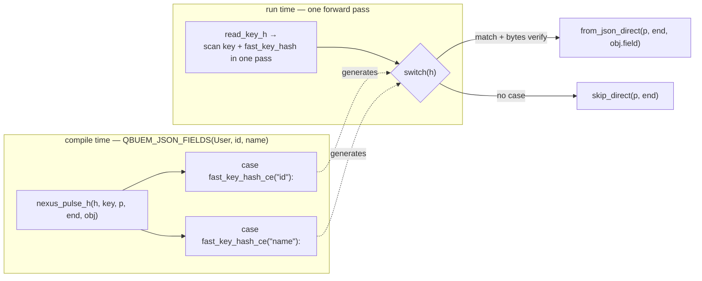

# Nexus Fusion: Zero-Tape Mapping

`qbuem::fuse<T>(text)` parses JSON directly into your C++ struct — no tape, no DOM, no intermediate state. When the parser encounters `"id"`, it hashes the key, looks up the corresponding struct member offset, and writes the value there. The tape is never built.

This page explains how that works, when it beats the DOM engine, and what it costs.

---

## What "0 KB allocation" actually means

The benchmarks report `0 KB` for struct parsing. That needs unpacking.

When we say 0 KB, we mean **structural allocation** — memory the parser itself uses to do its work. For the DOM engine, this is the tape. For Nexus, there is no tape, so it's literally zero.

The user's data — the `std::string` fields, `std::vector` elements, nested objects — still allocate when they need to. A struct with all `int` and `double` fields costs nothing beyond the struct itself. A struct with a `std::vector<std::string>` costs whatever the vector needs. That part is unavoidable and correct.

```cpp
struct Tick {         // fixed-size types only
    uint64_t seq;
    double   bid, ask;
    int      side;
};
// qbuem::fuse<Tick>(json) — zero heap allocation, period.

struct Order {        // contains dynamic types
    uint64_t    id;
    std::string symbol;   // ← one allocation for the string
};
// qbuem::fuse<Order>(json) — one allocation: the symbol string.
// The parser itself still uses zero.
```

---

## DOM vs Nexus: when to use which

The two engines are not competing — they handle different shapes of work.

**Use the DOM engine (`qbuem::parse`) when:**
- The JSON schema isn't known at compile time
- You need to inspect arbitrary keys or traverse unknown structure
- The document is large and you'll only read a small fraction of it
- You need mutations (`.set()`, merge patch)

**Use Nexus (`qbuem::fuse<T>` / `qbuem::read<T>`) when:**
- You have a fixed C++ struct and you want it filled as fast as possible
- You're in a hot loop processing thousands of identical messages per second
- You want zero tape allocation by construction, not as an optimization

A concrete HFT example: market data feeds deliver millions of JSON messages per day with the same shape. `qbuem::read<MarketTick>` on a warmed-up buffer processes each one without touching the allocator.

---

## How field dispatch works

The naive approach to mapping JSON keys to struct fields is string comparison — `if (key == "id") fill_id(val)` repeated for every field. This is O(N×F) where N is the number of keys and F is the number of fields. For a 20-field struct, that's 400 comparisons per object.

Nexus uses **compile-time key hashing** to reduce this to O(1) — raw little-endian bytes for short keys, FNV-1a for long ones. The `QBUEM_JSON_FIELDS` macro turns your field list into a `switch` whose case labels are computed at compile time; at runtime the scanner hashes each key once and jumps:



At compile time, `QBUEM_JSON_FIELDS(User, id, name, active)` generates one `switch` case per field, keyed on the field name's hash:

```cpp
constexpr uint64_t hash_id     = fast_key_hash_ce("id");     // raw LE bytes of "id"
constexpr uint64_t hash_name   = fast_key_hash_ce("name");   // raw LE bytes of "name"
constexpr uint64_t hash_active = fast_key_hash_ce("active"); // raw LE bytes
```

At parse time, when the scanner sees the key `"name"`:

<div class="bd-diagram">
  <div class="bd-col">
    <div class="bd-group" style="width:100%;max-width:520px;">
      <div class="bd-group__title">Parsing <code>{"id": 42, "name": "Alice"}</code></div>
      <div class="bd-group__body">
        <div class="bd-steps">
          <div class="bd-step">
            <div class="bd-step__num">1</div>
            <div class="bd-step__body">
              <div class="bd-step__title">Scan key</div>
              <div class="bd-step__desc">NexusScanner reads <code>"name"</code> — 4 bytes, no escape chars, SWAR fast-path.</div>
            </div>
          </div>
          <div class="bd-step">
            <div class="bd-step__num">2</div>
            <div class="bd-step__body">
              <div class="bd-step__title">Hash at runtime</div>
              <div class="bd-step__desc"><code>fast_key_hash("name")</code> — the scanner computes it in the same pass that reads the key, same result as the compile-time constant.</div>
            </div>
          </div>
          <div class="bd-step">
            <div class="bd-step__num">3</div>
            <div class="bd-step__body">
              <div class="bd-step__title">Switch on hash</div>
              <div class="bd-step__desc">Generated <code>switch(h)</code>: one case per field. Branch predictor wins on repeated schema.</div>
            </div>
          </div>
          <div class="bd-step">
            <div class="bd-step__num">4</div>
            <div class="bd-step__body">
              <div class="bd-step__title">Write directly</div>
              <div class="bd-step__desc"><code>std::from_chars</code> or <code>from_json_direct</code> writes value into <code>&obj.name</code>. No intermediate copy.</div>
            </div>
          </div>
        </div>
      </div>
    </div>
  </div>
</div>

For keys ≤ 8 bytes, the hash **is** the key: `fast_key_hash` loads the bytes as a single little-endian 64-bit integer and returns it — no fold, no multiply, no byte-by-byte loop. (9–16 byte keys XOR-fold the two halves with the length; keys longer than 16 bytes fall back to FNV-1a.) Because the compile-time `fast_key_hash_ce` and the runtime `fast_key_hash` are byte-identical, the `switch` labels and the scanned key always agree.

Because a hash *could* collide, every matched case re-checks the raw key bytes (`_key == "name"`) before writing the field — exactly what the generated `nexus_pulse_h` does — so a collision can never silently mis-route a value.

---

## Unknown fields and malformed input

`qbuem::fuse<T>` doesn't fail on unknown fields — it skips them. A JSON payload with extra keys `{"id": 1, "debug_trace": {...}, "name": "Alice"}` will populate `id` and `name` and silently skip `debug_trace`. No allocation occurs during the skip.

Malformed JSON throws `std::runtime_error` with the stream position. The parser is single-pass, so detection is immediate.

Deep nesting doesn't cause stack overflow. The parser iterates rather than recurses, so `{"a": {"b": {"c": ...}}}` at any depth is handled with fixed stack space.

---

## QBUEM_JSON_FIELDS macro

This macro is the entry point. It generates both the Nexus dispatch table and the DOM compatibility layer:

```cpp
struct User {
    uint64_t    id;
    std::string name;
    bool        active;
};
QBUEM_JSON_FIELDS(User, id, name, active)

// Now both engines work, from the same registration:
qbuem::Document doc;
auto root = qbuem::parse(doc, json_text);   // DOM: navigate root["id"], mutate, dump

User u1 = qbuem::read<User>(json_text);     // DOM path → struct (builds the tape)
User u2 = qbuem::fuse<User>(json_text);     // Nexus path → struct (no tape)
```

The macro must sit at **namespace scope** (not inside the struct) — it defines ADL
free functions, and placing it inside the struct breaks lookup. It supports up to 32
fields; beyond that, write the ADL hooks (`from_qbuem_json` / `nexus_pulse` /
`qbuem_json_append_fw`) by hand — same performance, no limit.

## Macro-free fuse (no registration)

On GCC/Clang you don't even need the macro. A **plain aggregate** — public members, no
user-declared constructors, no base classes — fuses straight from reflected field names.
Each template instantiation reflects on its own and nested aggregates recurse, so generic
DTOs work with **no per-type registration**:

```cpp
template <class T>
struct Envelope { T payload; uint64_t seq; std::string trace_id; };  // no macro

auto e = qbuem::fuse<Envelope<Order>>(bytes);   // reflects Envelope<Order> automatically
```

The only difference from the macro is the **dispatch**: the macro emits a compile-time
`switch` over field-name hashes (`O(1)`), while the macro-free path compares the scanned
key's hash against each reflected field name (`O(fields)`). For small/medium structs that
is near-parity; for **very wide hot-path structs** the macro stays the peak option
(≈1.5× on a realistic DTO, growing with field count). A `QBUEM_JSON_FIELDS` /
`QBUEM_JSON_FIELDS_TPL` registration, when present, always wins. Full rules:
[Macro-Free Mapping](/guide/mapping#macro-free-mapping-aggregate-reflection).
