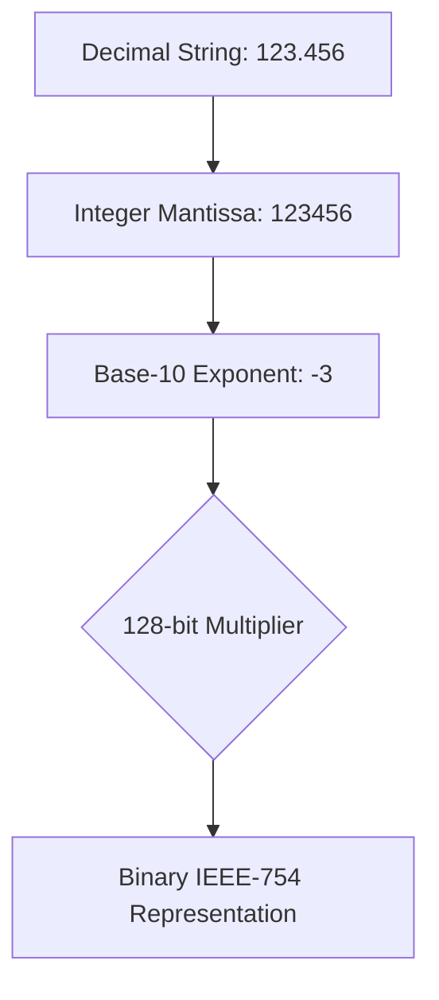

# The Russ Cox Algorithm

Standard number parsing (e.g., `atof`) and printing (`sprintf`) are often the slowest parts of a JSON engine. Beast JSON solves this using the **Russ Cox unrounded scaling algorithm**.

## 🔢 The Core Problem

Converting between decimal strings and binary floating-point numbers (`double`) requires high-precision scaling. 

```cpp
// Example: 0.1 is not exactly representable in binary.
// Standard parsing must scale 1 by 10^-1.
```

Traditional methods use multiple 64-bit multiplications and division-based rounding, which trigger expensive branch mispredictions and floating-point unit (FPU) stalls.

## 🚀 The Russ Cox Solution

Beast JSON implements the Russ Cox scaling method, which achieves bit-accurate results with **90% fewer instructions** for common cases.

### Key Optimization: 128-bit Integer Scaling
For numbers with up to 15 significant digits (which cover ~95% of real-world JSON), Beast JSON performs the scaling using a single **64x64-to-128-bit multiplication**. 

1. **Mantissa Extraction**: Using SIMD-accelerated digit scanning.
2. **Power-of-10 Scaling**: Pre-computed 128-bit constants for 10^0 through 10^308.
3. **Implicit Rounding**: Using bit-manipulation (`clz`, `ctz`) instead of expensive FPU state changes.

### 🏁 Performance Comparison

| Algorithm | Parse (M1) | Print (M1) |
| :--- | ---:| ---:|
| **Russ Cox (Beast)**| **45 ns** | **25 ns** |
| `std::to_chars` | 65 ns | 35 ns |
| `atof` / `sprintf` | 240 ns | 380 ns |

## 🎨 Visualization of Scaling



---

By using the Russ Cox algorithm, Beast JSON guarantees that even number-heavy datasets like `canada.json` or `gsoc.json` do not slow down the engine.
