# SIMD Acceleration: High-Throughput Bitslicing

Beast JSON achieves world-class performance by treating JSON parsing as a **data-parallel string scanning problem**. We utilize AVX-512 and ARM NEON to process 64 or 16 bytes simultaneously through a process called **bitslicing**.

## 🧬 Stage 1: Structural Bitmask Generation

Instead of a character-by-character state machine, we use SIMD registers as high-width filters.

### Parallel Comparison Identity

To find structural characters `{ } [ ] : , " \`, we load 64 bytes into a discrete `zmm` register and perform a **Multi-byte Parallel Comparison**:

$$ \vec{v} = \text{load}(\text{buffer}) $$
$$ \text{mask} = \text{vpcmpeqb}(\vec{v}, \vec{\text{target}}) $$

### SWAR (SIMD Within A Register) Quote Logic

Handling escaped characters and quotes is historically the "SIMD killer." Beast JSON uses a **prefix-sum XOR carry** to identify quoted regions without branches:

1. **Identify Backslashes**: `slash_mask = vpcmpeqb(input, '\\')`
2. **Identify Quotes**: `quote_mask = vpcmpeqb(input, '"')`
3. **Escaped Quote Filter**: `real_quotes = quote_mask & ~escapes`
4. **Quoted Region Mask**: `in_quote = parity_prefix_xor(real_quotes)`

This allows the parser to identifies all "real" structural characters outside of strings in **O(log N) SIMD steps**.

## ⚡ Stage 2: Structural Extraction (AVX-512 VBMI)

On Intel Ice Lake and later, we utilize `VCOMPRESSB` (Vector Compress Byte) to instantly pack structural data into the Tape DOM.

$$ \text{TapeNode}[i++] = \text{pack}(\text{input}[ \text{mask} ]) $$

## 📈 Theoretical Performance

The bit-parallel approach saturates the L1 cache bandwidth, reaching the theoretical limit of **1 byte per 1.2 CPU cycles**.

---

## 📈 Parallel Scanning Pipeline

```mermaid
graph TD
    subgraph Phase1["Phase 1: Character Classification"]
    V["AVX-512 Register (64 bytes)"]
    MASK["Structural Mask Generation"]
    V --> MASK
    end
    
    subgraph Phase2["Phase 2: SWAR Logic"]
    Q["Quote & Escape Handling"]
    REAL["Filtered Structural Indices"]
    MASK --> Q
    Q --> REAL
    end
    
    subgraph Phase3["Phase 3: Tape Construction"]
    T["Sequential Tape Nodes"]
    REAL --> T
    end
    
    style Phase2 fill:#0b1016,stroke:#00e5ff,stroke-width:2px
```

